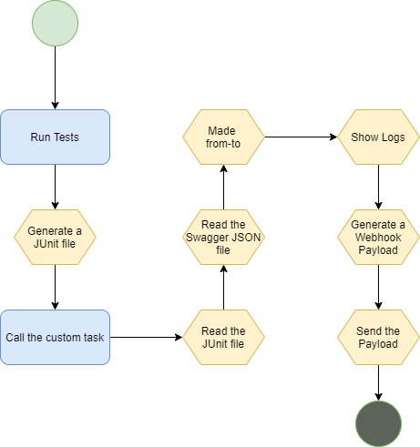
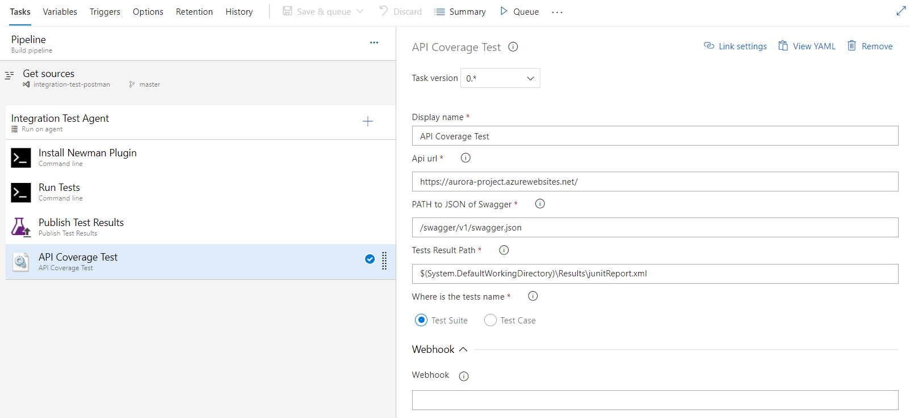

# Coverage API Integration Test for Azure DevOps Pipelines

This project is a custom task that you can include in your pipeline on Azure DevOps.
According to the JSON file of Swagger of API and the JUnit file result test, it is made a from-to both files and generates a tests coverage percent.

## The flow

## How to use
This is the window of Custom Task in a Pipeline:
